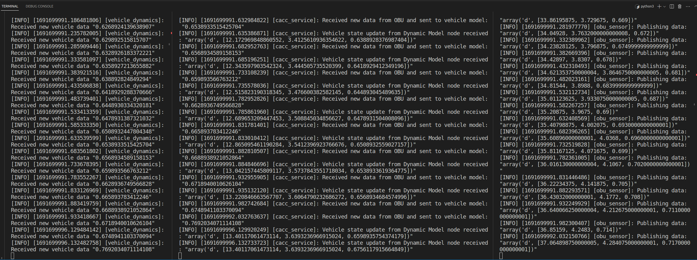
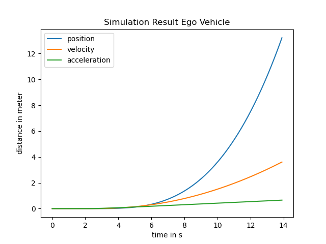

# CACC Service demo

Created for Practical "Cooperative Motion Planning" course of MPFAV SS2023.

This project consists of two ros2 packages, and a python class that can be run independently as a script. Instructions below.

- Python package `cacc_service` consist of three ros2 nodes, a dummy OBU node acting as a publisher, and a CACC service and VehicleDynamics node acting both as a subscriber and publisher.

- CPP package `cacc_interfaces` contains three .msg classes for the communicaion between these components.

They should be installed together as shown below. 

## Description

They simulate a OBU-CACC-VehicleDynamics loop for a set time of 20 seconds. Then saves the plot in the workspace folder of this package.

1. OBU node `obu_sensor_node.py` publishes to 'obu_topic' to which the CACC service node `cacc_service_node.py` subscribes. 

2. The CACC service node computes input u and publishes to 'acceleration_topic' to which the Vehicle node `vehicle_dynamics.py` subscribes.

3. The Vehicle node computes the next vehicle state, and sends it to CACC service node again. 

4. OBU node publishes data again, CACC computes input u again, etc.

A plot is shown during the execution.

A plot figure is saved in the ros2 workspace where this package was executed.

## Installation of the ros2 packages

### 1. Clone and install dependencies


Make sure [ROS2 is installed](https://docs.ros.org/en/humble/Installation/Ubuntu-Install-Debians.html) on your system. 

Clone this repository and `cd` into it, containing this README.md file and the `src/` directory: 


E.g. `local_ws/` contains it, and you have a similar structure:

```
local_ws/
├── README.md
├── docs/
├── src/
│   ├── cacc_service/
│   └── cacc_interfaces/
└── ...
```


- install dependencies inside root of local_ws/ (change 'humble' to your ros2 distro):

```
rosdep install -i --from-path src --rosdistro humble -y
```

### 2. Build packages

- build packages with colcon (again inside local_ws/, and see [ros2 installation](https://docs.ros.org/en/humble/Installation/Ubuntu-Install-Debians.html) docs if command not available)

```
colcon build
```

Next to `src/` new folders such as `build`, `install`, ... appeared. One warning might appear, save to ignore.

### 3. Run nodes 

- in three new terminals, in each, first source inside local_ws/:

```
  source install/setup.bash
```
- then run each node in respective terminal:

1. Run Vehicle model first:
```
ros2 run cacc_service vehicle_model
```
2. Run CACC Service:
```
ros2 run cacc_service cacc_service
```

3. Run OBU sensor:
```
ros2 run cacc_service obu_sensor
```

Logging should appear, the simulation will run for around 20 seconds. After all nodes stop logging, a plot will appear. Close plot, close all three nodes with `Ctrl+C`

If OBU node runs first, data will be published but catched by no one.

- During simulation, data exchange will be logged:


Logs of: | Vehicle model | CACC Service | OBU |




- At the end, a plot of the simulation with the three nodes will appear.





### Development

After changing code, run steps 2. and 3. again. If adding dependencies, update your package.xml.


## Running CACC class in standalone mode

For functional demo of the CACC algorithm, the CACC.py class inside `cacc_service/cacc_service/cacc.py` can be run alone:

```
python3 cacc.py standalone
```
It will create a plot file in current directory after finishing.


## Known issues

- Make sure numpy is installed in your python environment. 

- Running this repository in multiple directories simulaneously may lead to interference between them. Make sure previously ran nodes are closed (Ctrl+C) before starting this project in new folder.